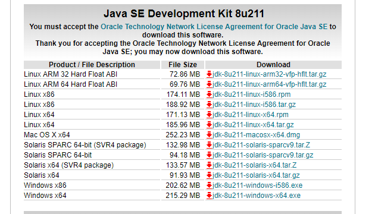
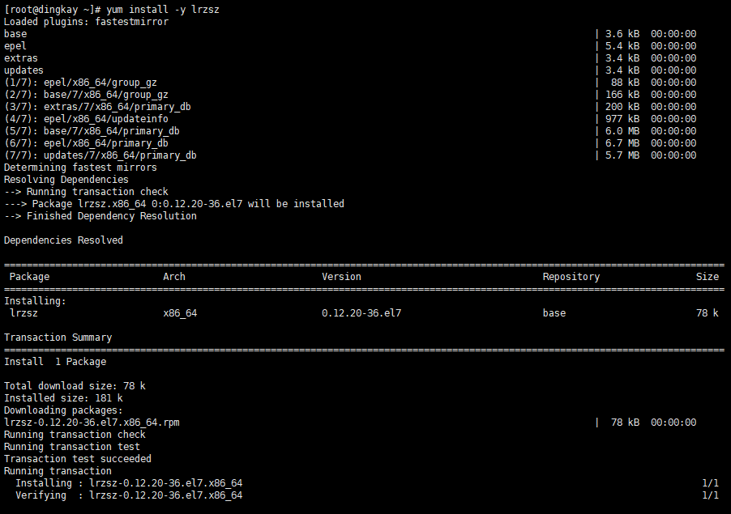

## Java JDK

* 一、Java JDK介绍

  > JDK(Java Development Kit) 是Java语言的软件开发工具包，主要用于移动设备、嵌入式设备上的Java应用程序。JDK是整个Java开发的核心，它包含了Java的运行环境(JVM + Java系统类库) 和Java工具

* 二、Java JDK的版本说明

  1. JDK(Java Development Kit) 是Java语言的软件开发工具包(SDK)。

  2. SE(Java SE) Standard Edition 标准版，是我们常用的一个版本，从JDK5.0开始，更名为JavaSE

  3. EE(Java EE) Enterprise Edition 企业版，使用这种JDK开发J2EE应用程序，从JDK5.0开始，更名为Java EE。从2018年2月26日开始，J2EE更名为Jakarta EE

  4. ME(J2ME) Micro Edition 主要用于移动设备、嵌入式设备上的Java应用程序，从JDK5.0开始，更名为Java ME。

     >没有JDK的话，无法编译Java程序(指Java源码 ``` .java 文件 ```) 如果只想运行Java程序(指```Class```或者```Jar```等其他归档文件)则只需要安装相应的JRE。

     

* 三、[JDK下载](https://www.oracle.com/technetwork/java/javase/downloads/index.html)

* 四、JDK安装与配置环境变量(Windows环境)

  * 点击```下一步```完成安装

  * 配置环境变量：`ClassPath` `JAVA_HOME` `Path`

  * `CLASS_PATH` *lib* 目录下的dt.Jar 以及 tools.Jar 和 最重要的 `.`<br><br>
   ```
   配置`.`的目的是由于LINUX的安全机制引起的，LINUX用户很明白，WINDOWS用户就很难理解(因为WINDOWS默认的搜索顺序是先搜索当前目录的，再搜索系统目录的，再搜索PATH环境变量设定的) 。
   为什么CLASSPATH后面指定了tools.jar这个具体文件？不指定行不行？显然不行，行的话我还能这么罗索嘛！:) 这个是由java语言的import机制和jar机制决定的，你可以查资料解决。
   ```

  * `Path` JDK的*bin*目录<br>

  * `JAVA_HOME` 代表你的JDK安装路径<br>

    **TIPS:**

    以上三个环境变量，仅当需要在`Commond`命令行中 **编译** 以及 **运行** Java文件时才需要配置。

    `ClASS_PATH` 中的`.`代表当前目录，如果在任意目录编译单个Java文件，编译成的Class文件的路径是从`CLASS_PATH`中找。如果不配置此项可能能 **编译** 但 **执行** Class文件报错。

    如果使用的是老版本的`Commond` 并且 输出打印中文，出现中文乱码，需要切换活动代码页：

    

    命令`chcp`切换活动代码页，此时跟系统的编码有关。尝试一下两种编码即可解决。

    

    

* 五、CMD命令查看是否安装成功<br>
  `java -version`

  

---

以上则安装Java JDK成功。

补充：Linux环境下安装jdk

1. 去官网下载一个Linux版本的jdk


2. 使用`yum install` 安装 `lrzsz`命令包

3. `rz -be` 上传到服务器上

4. `tar -zxvf` 解压压缩包<br>
   
5. 为了一会配置环境变量更方便，将解压包改名并且移动位置<br>

6. 配置环境变量<br>

7. 使用命令刷新环境变量，使之即刻生效

以上，Linux上的jdk安装成功。