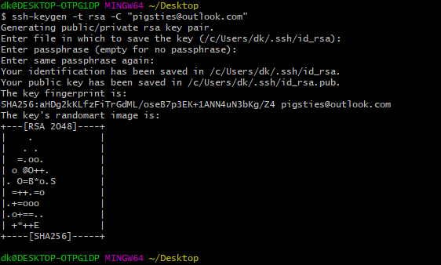
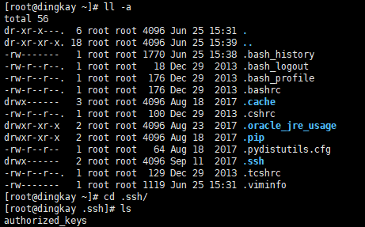

# Linux

## 常用

1.更改系统hostname<br>
> hostnamectl set-hostname `<new hostname>`

使用该命令修改`hostname` 并且重启生效<br>


修改后查看`hosts`文件<br>


该命令不会修改`/etc/hosts`文件中的`hostname`需要手动修改文件

---

2.搭建Git环境
> yum install -y git

使用 `yum` 命令安装<br>


安装后使用 `git --version` 查看版本信息<br>
<br>
则安装成功
<br>
则安装失败

查询是否存在用户,不存在则创建用户git用于仓库管理(UserName:git)<br>


创建文件夹,作为git的仓库

在git仓库目录下,再创建项目仓库目录<br>


> git init --bare `<fileName>`

初始化项目仓库并查看该文件权限<br>


目前该目录的权限是>root 用户 现在更改为>git 用户<br>


更改完毕后,本地进行`clone` 测试<br>


生成公钥以及密钥<br>


查看生成的`ssh`文件<br>


进入`ssh`目录更改服务端的`ssh`配置<br>
> cd /etc/ssh


> vim sshd_config

修改`ssh`配置文件,注释其中三条配置<br>


查看`sshd`服务的状态,并重启.此时,查看`~`目录下的`.ssh`目录



如果你需要把项目中的某一个文件夹作为项目目录，你需要把服务器上的公钥配置到git用户的权限之下，也就是我们创建的`git`用户的`.ssh`中的`authorized_keys`

创建git用户下的`.ssh`文件,并且修改权限组<br>


将本地之前生成的密钥上传至服务器<br>


服务器上查看`.ssh`目录<br>


修改权限很重要,使用`chmod 700 .ssh`命令修改目录权限,进入`.ssh`使用`chmod 600 authorized_keys`修改刚刚上传的认证密钥文件的权限<br>
修改后的:
<br>


现在从服务器上面`clone`就不需要密码了.

```
Tips:
    使用 `git init --bare` 初始化仓库没有 working tree (工作区)
    而使用 `git init` 初始化的仓库是有 working tree 的
    在初始化远程仓库的时候,推荐使用第一种方式,初始化一个`裸`仓库,保证在提交后,`push`到远程仓库的时候不会出现冲突等情况的发生 (裸仓库是不可以进行任何的 `git <*>` 命令的操作,防止在`push`的同时,有人在远程仓库上进行操作,导致出现问题. )
```