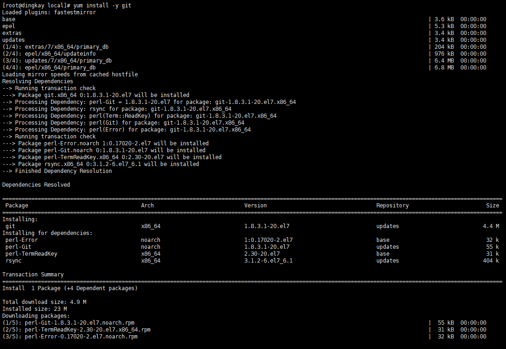

# Linux

## 常用

1.更改系统hostname 
> hostnamectl set-hostname `<new hostname>`

使用该命令修改`hostname` 并且重启生效 

修改后查看`hosts`文件 

该命令不会修改`/etc/hosts`文件中的`hostname`需要手动修改文件

---

2.搭建Git环境
> yum install -y git

使用 `yum` 命令安装 

安装后使用 `git --version` 查看版本信息 
 
则安装成功
 
则安装失败

查询是否存在用户,不存在则创建用户git用于仓库管理(UserName:git) 

创建文件夹,作为git的仓库

在git仓库目录下,再创建项目仓库目录 

`git init --bare <fileName>` 初始化项目仓库并查看该文件权限 

目前该目录的权限是>root 用户 现在更改为>git 用户 

更改完毕后,本地进行`clone` 测试 

生成公钥以及密钥 

查看生成的`ssh`文件 

更改服务端的`ssh`配置 
