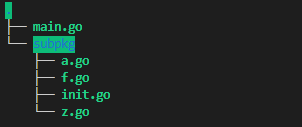

# Golang基础

## Go简介

Go又称Golang，是Google开发的一种静态强类型、编译型、并发型，并具有垃圾回收功能的编程语言 -- 维基百科

Go语言的特点：语法简洁，开发效率高，执行性能好（天生支持并发）

## 安装环境

 Go官网下载地址：https://golang.org/dl/

 Go官方镜像站（推荐）：https://golang.google.cn/dl/

```
go语言迭代更新比较快，推荐使用较新的版本，体验新特性。
```

`go version` 查看Go当前版本号

### 配置环境变量

#### GOPATH、GOROOT

`GOPATH` 和 `GOROOT` 都是环境变量，其中，`GOROOT` 是安装Go的路径，而从Go 1.8 版本开始，Go安装包在安装完成后会为 `GOPATH` 设置一个默认目录，参见下表：

| 平台    | GOPATH默认值     | 举例               |
| ------- | ---------------- | ------------------ |
| Windows | %USERPROFILE%/go | C:\Users\用户名\go |
| Unix    | $HOME/go         | /home/用户名/go    |

 我们只需要记住默认的GOPATH路径在哪里就可以了，并且默认情况下 `GOROOT`下的bin目录及`GOPATH`下的bin目录都已经添加到环境变量中了，我们也不需要额外配置了。 

并且在Go 1.11 版本开始，`go mod` 的出现 `GOPATH` 的配置显得不那么重要了。

`GOPATH`路径下

`src`：用来存放源码文件， 任何使用 `go get` 命令安装的包也将驻留在这里 (*及其依赖包*)。 

`pkg`：用来存放编译后生成的归档文件，他们以 `.a` 作为文件扩展名 (**.a** 代表 ***存档***)。

`bin`：用来存放编译后生成的可执行文件（可以将此目录添加到`PATH`中）

#### GOPROXY

 Go 1.14版本之后，都推荐使用`go mod`模式来管理依赖环境了，也不再强制我们把代码必须写在`GOPATH`下面的src目录了，你可以在你电脑的任意位置编写go代码。（网上有些教程适用于1.11版本之前） 

 默认 `GOPROXY` 配置是：`GOPROXY=https://proxy.golang.org,direct`，由于国内访问不到`https://proxy.golang.org`，所以我们需要换一个PROXY，这里推荐使用`https://goproxy.io`或`https://goproxy.cn`。 

 可以执行下面的命令修改GOPROXY： 

```go
go env -w GOPROXY=https://goproxy.cn,direct
```

## Go项目结构

在进行Go语言开发的时候，我们的代码总是会保存在 `$GOPATH/src` 路径下。在工程经过 `go build` 、 `go install` 或 `go get` 等指令后，会将下载的第三方包源码文件放在 `$GOPATH/src` 目录下，产生的二进制可执行文件放在 `$GOPATH/bin` 目录下，生成的中间缓存文件会被保存在 `$GOPATH/pkg` 下。

如果我们使用版本管理工具（Version Control System，VCS，如：Git）来管理我们的项目代码时，我们只需要添加 `$GOPATH/src` 目录的源代码即可。`bin` 和 `pkg` 目录的内容无须版本控制。

### 个人开发

在 `$GOPATH/src` 路径下，创建项目一、项目二、项目三...

### 目前流行的项目架构

Go语言中也是通过包来组织代码文件，我们可以引用别人的包，也可以发布自己的包，但是为了防止不同包的项目名冲突，我们通常使用 `顶级域名` 来作为包名的前缀，这样就不用担心项目名冲突的问题了。

例如：`$GOPATH/src` 路径下创建 `github.com/dingkay/goProject`

```go
import "github.com/dingkay/goProject"
```

从GitHub上下载别人包的时候，执行：

```go
go get github.com/dingkay/goProject
```

那么，这个包会下载到我们本地 `$GOPATH/src/github.com/dingkay/goProject` 目录

### 企业开发

`$GOPATH/src/{公司域名}/{公司部门、组}/{项目名}/{module}`

## IDE

Go采用的是 `UTF-8` 编码的文本文件存放源代码，理论上使用任何一款文本编辑器都可以做Go语言的开发，推荐使用 `VS Code` 和 `Goland`

## 第一个Go程序

路径 `$GOPATH/src/github.com/dingkay/study/day01/helloworld` 下创建 `main.go` 文件，代码如下：

```go
package main

import (
	"fmt"
)

func main() {
	fmt.Println("Hello World!")
}
```

在项目路径下执行 `go build` 编译成二进制可执行文件

问题：执行build命令时提示：`go: cannot find main module; see 'go help modules'`

解决方案：由于设置了 `GO111MODULE=on`，所以需要初始化 go mod

执行：`go mod init {项目名}` 例如：`go mod init hello` 生成了一个 go.mod 文件，然后再执行编译命令，编译成功。

原因：为了提高下载依赖包的速度，配置了 `GOPROXY`，设置了配置如下：

```go
// 开启go mod依赖管理 on/off/auto
go env -w GO111MODULE=on
// 配置依赖下载代理
go env -w GOPROXY=https://goproxy.cn,direct
```

这使得Go默认管理依赖的方式变成了 go module 模式，即依赖一个 go.mod 文件，其中描述了项目依赖的包和版本（类似于npm package.json，Java的maven pom.xml）

而目录中没有 go.mod 文件，所以Go不知道主模块时什么，所以无法编译

 go语言在诞生之时，没有提供随之的包管理工具，而是使用 `go get` 来下载依赖包，并放在`$GOPATH/src`下，并且没有使用版本控制，每次都会拉取master分支的代码，软件包的代码放在src/github.com/xx/xx下面 

 而Go 1.11 版本及之后的版本引入了Go模块（Go Modules），Go Modules使用 go.mod 中标记的软件包的版本，软件包的代码放在 `pkg/mod` 下面

### 使用Go Modules 还是 GOPATH

 Go使用一个环境变量 `GO111MODULE` 来决定使用Go Modules还是GOPATH，该变量有三个值，并在不同版本下有不同的语义

| 配置               | 1.11版本&1.12版本                                            | 1.13版本及以后                                               |
| ------------------ | ------------------------------------------------------------ | ------------------------------------------------------------ |
| GO111MODULE = on   | 不管在GOPATH 中还是外，都强制使用go.mod                      | ~                                                            |
| GO111MODULE = off  | 强制 Go 表现出 GOPATH 方式，即使在 GOPATH 之外               | ~                                                            |
| GO111MODULE = auto | 在GOPATH外时，GO111MODULE = on，在GOPATH内时，GO111MODULE = off | 当有go.mod或者在GOPATH 之外，GO111MODULE = on，当处于 GOPATH 内且没有 go.mod 文件时，GO111MODULE = off |

### 程序编译

在项目路径下执行 `go build`

编译成功后，会在当前路径下生成一个可执行的二进制文件

Window下默认编译成 `.exe`，如果需要在Windows中编译Linux程序，可以修改 `GOOS`

#### 非项目路径下编译程序

在其他路径下执行`go build`，需要在命令后加上项目的路径（`$GOPATH/src` 路径可以省略）

例如，项目路径为：`$GOPATH/src/github.com/dingkay/study/day01/helloworld`

则打包命令为：`go build github.com/dingkay/study/day01/helloworld`

打包成功后，二进制可执行文件生成与执行命令的路径下


```
Tips:在非项目路径下执行 go build，需要将 GO111MODULE 修改为 off 或者 auto
```

#### 跨平台编译

在Windows平台下，编译Linux平台的执行程序，或者MacOS平台下的执行程序

将配置 `CGO_ENABLED=1` 修改为 `CGO_ENABLED=0` 不禁用CGO可能会导致一些问题

修改 `GOOS=linux` （MacOS为 `GOOS=darwin`）

修改处理器架构 `GOARCH=amd64`

执行编译命令，则编译出来的二进制文件为Linux平台下的程序

#### 编译时指定生成的文件名称

执行命令：`go build -o {文件名}`

### 常用命令

直接执行 go 程序：`go run {文件名}`，此命令不常用，推荐使用 `go build` 编译后再启动。

编译并将二进制程序复制到 `$GOPATH/bin` 路径中： `go install`，同样 `go install` 命令在非项目路径下执行，在命令后加上目路径即可。由于我们将 `$GOPATH/bin` 添加到了 `$PATH` 环境变量中，我们可以在任何路径下执行我们编译后的二进制可执行文件。

## 基本语法

### 包（package）

每一段 Go 程序都 **必须** 属于一个包。一个标准的可执行的 Go 程序必须有 `package main` 的声明。如果一段程序是属于 main 包的，那么当执行 `go install` 的时候就会将其生成二进制文件，当执行这个文件时，就会调用 main 函数。如果一段程序是属于 main 以外的其他包，那么当执行 `go install` 的时候，就会创建一个 `包管理` 文件。

```
包的声明并非一定要与包名同名。因此，你可能会发现很多包的包名（文件夹名）与其内部声明的名字是不同的。当引用包的时候，需要使用包的声明来作为引用变量。
```

执行 `go install` 后，首先会在当前目录寻找 ` package main` 包声明的文件，Go就会将其编译成可执行的二进制文件。并将其复制到 `$GOPATH/src/bin` 路径下，一个包里面有很多的文件，但只能有一个 `main` 函数，其标志着一个程序的入口。

```go
package main

import "fmt"

func main() {
	fmt.Println("pkg/main/main.go => print")
}
```


如果没有 `main` 包声明的文件，那么Go就会在 `$GOPATH/pkg` 路径下创建 `包管理` （后缀 `.a`）文件。

```go
package app

import "fmt"

func main() {
	fmt.Println("pkg/appPrint/app.go => print")
}
```

则 `$GOPATH/pkg/windows_amd64/github.com/dingkay/study/day01/pkg` 


#### 包的命名规范

关于包的命名，Go 团队建议以简单，扁平为原则。例如， `strutils` 是 `string utility` 函数的名字， `http` 是 `HTTP` 请求的名字。

包的名字应避免使用下划线，中划线或掺杂大写字母。

#### 创建包

包分为两种：

可执行的包（main包）：可执行的包可以看作是主应用，编译后为可执行的程序。

工具包（非main包）：工具包自身是不可执行的，但是它会给主应用（可执行的包）增加一些功能，从而起到扩展主应用的作用。

#### 引用包

使用 `import`  语法引用包。Go 首先会在 `$GOROOT/src` 目录中搜索指定的包，如果找不到，再去 `$GOPATH/src` 目录中找。 `fmt` 包来自于Go的标准库，因此可以在 `$GOROOT/src` 路径中找到它。而不属于标准库中的包，在 `$GOROOT/src` 路径中找不到它，就会去 `$GOPATH/src` 中找

**greet**包

```go
package greet

var morning = "Good Morning"
var Morning = "Hey!" + morning
```

在main包中引入**greet**包

```go
package main

import (
	"fmt"

	"github.com/dingkay/study/day01/greet"
)

func main() {
	fmt.Println(greet.Morning)
}
```

引用包的方式主要有两种：

单独引包： `import "{packageName}"`

组合引包： `import ( "{packageName1}" "{packageName2}" "...")`

#### 包的访问权限

可以使用 `.` 符号来获取包的输出项，当一个包被引用的时候，Go会使用 `包的声明` 把这个包创建为全局变量。上述例子中，`greet` 就是全局变量，`greet.Morning` 可以直接访问输出项，但由于 `morning` 变量是 `greet` 包私有的， `greet.moring` 编译会报错，无法在包外访问私有的输出项。

##### 包的scope


main.go

```go
package main

import "fmt"

func main() {
	fmt.Print("version ==> " + version)
}
```

app.go

```go
package main

var version = "1.0.0"
```

 **scope 是指代码块中可以访问已定义变量的区域**。包的 scope 是指在一个包中 (包括包里的所有文件) 可以访问已定义变量的区域。这个区域是包中所有文件的顶层块。 

 Go能够识别出应用的入口文件，因为它里面有 `main` 函数

尽管 `app.go` 文件中的 `version` 没有开头大写，但是我们依然可以在包内的任何地方访问它，因为它是在包的 scope 中声明的。如果 `version` 变量是在一个函数中声明的，那么它就不属于包的 scope 范畴，上面的程序就会出错。

**不可以在一个包中重复声明全局变量**。因此，一旦 `version` 声明了，在包的 scope 内，就不可以再次声明。但是你可以在 scope 以外的任何地方声明。

#### 包的嵌套

 可以在一个包中嵌套另一个包。因为在 Go 中，一个包就是一个目录，所谓嵌套，就相当于是在一个包中创建一个子目录。我们需要做的，就是指明其路径关系。 

```go
package main

import (
	"fmt"

	"github.com/dingkay/study/day01/pkgtest/pkg1"
	"github.com/dingkay/study/day01/pkgtest/pkg1/pkg2"
)

func main() {
	fmt.Println(pkg1.PkgMsg)
	fmt.Println(pkg2.PkgMsg)
}
```

输出结果：

### 变量初始化

如果变量 `a` 依赖 `b` ，那么就要先初始化变量 `b`，否则无法编译。Go在函数内部会遵循这个原则

```go
package main

func main() {
	var a int = b
	var b int = c
	var c int = 6
}
```

执行失败：

但是在包的 scope 中定义的变量，它们在初始化周期中就已经被声明了。

```go
package main

import "fmt"

var a int = b
var b int = c
var c int = 9

func main() {
	fmt.Print(a, b, c)
}
```

执行结果：

在上面的例子中，首先是变量 `c` 被赋值了。在下一个初始化周期时，变量 `b` 被赋值，因为它依赖于变量 `c`，而 `c` 已经被赋值了。在最后一次初始化周期中，变量 `a` 被赋予变量 `b` 的值。Go 可以处理复杂的初始化周期。

```go
package main

import "fmt"

var a int = b
var b int = f()
var c int = 2

func f() int {
	return c + 1
}

func main() {
	fmt.Print(a, b, c)
}
```

执行结果：

注意，要避免像下面这样递归式的初始化循环

```go
package main

import "fmt"

var a int = b
var b int = c
var c int = a

func main() {
	fmt.Print(a, b, c)
}
```

执行结果：

### Init 函数

跟 main 函数一样，当初始化包的时候，init 函数也会被执行。它没有参数，也没有返回值。init 函数是由 Go 来声明的，你无法引用这个函数（ 也不能用类似 *init()* 的方式调用它）。你可以在一个文件或一个包中定义多个 init 函数。在同一个文件中，init 函数是按照它们被定义的先后顺序被执行的。

```go
package main

import "fmt"

func init() {
	fmt.Println("main.go ==> init() [1]")
}

func init() {
	fmt.Println("main.go ==> init() [2]")
}

func init() {
	fmt.Println("main.go ==> init() [3]")
}

func main() {
	fmt.Println("main.go ==> main()")
}
```

执行结果：

 你可以在包中的任何位置定义 `init` 函数。这些 `init` 函数以词法文件名的顺序（字母顺序）被调用。 



a.go

```go
package subpkg

import "fmt"

var Test string = ""

func init() {
	fmt.Println("init ==> a.go")
}
```

f.go/z.go 略

init.go  在main.go中引用，触发初始化包 scope

```go
package subpkg

var InitMsg = "started init"
```

main.go

```go
package main

import (
	"fmt"

	"github.com/dingkay/study/day01/initfunc/pkgscope/subpkg"
)

func main() {
	fmt.Print(subpkg.InitMsg)
}
```

执行结果：

 当所有的 `init` 函数被执行以后，`main` 函数才会被执行。因此，**`**init**` 函数 的主要工作就是，初始化无法在全局范围内初始化的全局变量** 。例如，初始化数组。 

